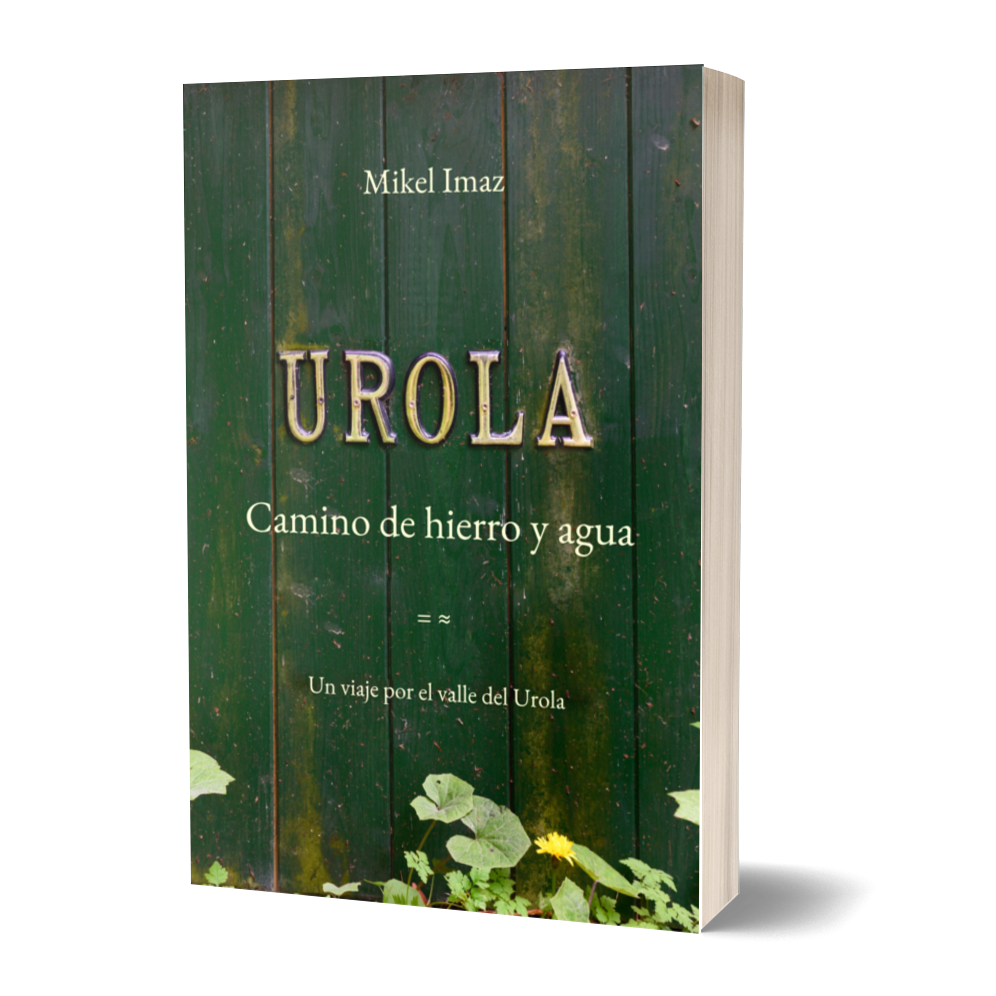
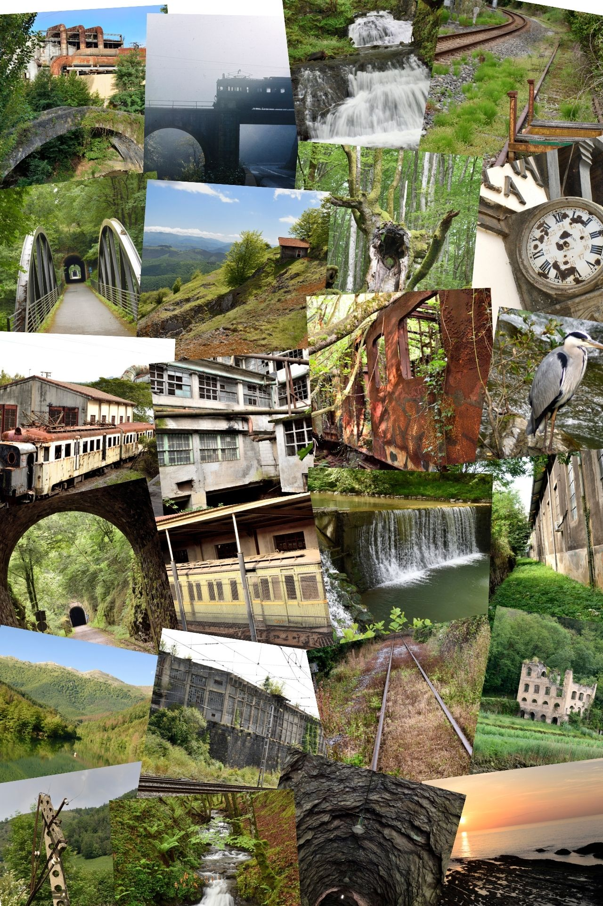

# Un viaje por el valle del Urola

{ width="450" }

>«Un recorrido de tres días y varios siglos por la historia y los parajes únicos de este valle guipuzcoano».  
>«Una indagación del progreso, la naturaleza y el tiempo».  
>«Una invitación a la exploración de cercanía, al descubrimiento y al asombro».

&nbsp;

- :material-cart: &nbsp; [Comprar](comprar.md)
- :material-rss: &nbsp; [Blog](blog.md)
- :material-paperclip: &nbsp; [Extras](extras/index.md)
- :material-bookshelf: &nbsp; [Otro viaje](otro.md)
- :material-face-man: &nbsp; [Contacto](contacto.md)

