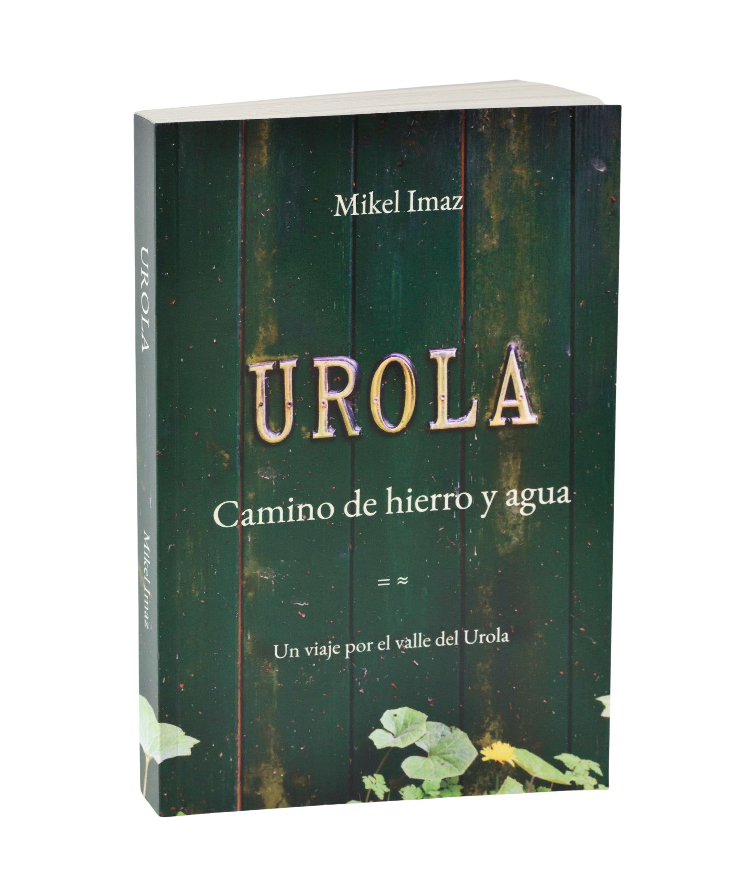
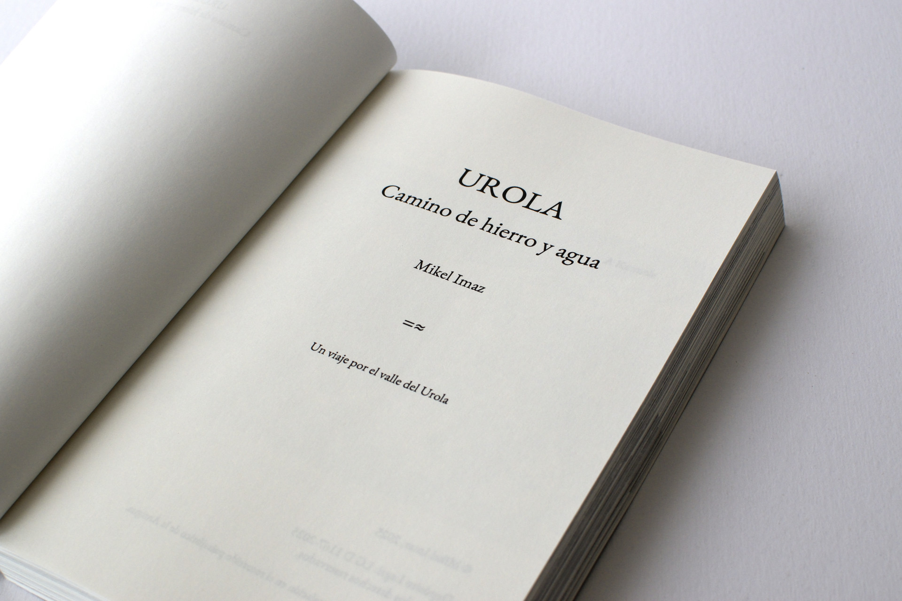
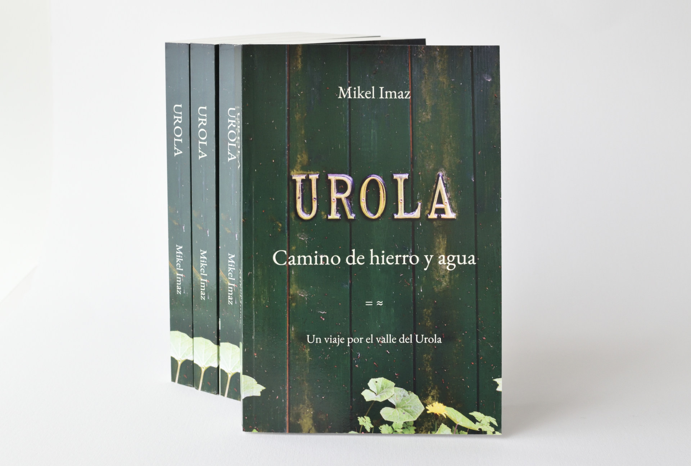

# Un viaje por el valle del Urola

{ width="450" }

&nbsp;

<iframe width="560" height="315"
  src="https://www.youtube.com/embed/mlxv2oKePEc"
  title="YouTube video player"
  frameborder="0"
  allow="accelerometer; autoplay; clipboard-write; encrypted-media; gyroscope; picture-in-picture"
  allowfullscreen>
</iframe>

&nbsp;

# Urola. Camino de hierro y agua

Un recorrido de tres días y varios siglos por la historia y los parajes únicos de este valle.

Una indagación del progreso, la naturaleza y el tiempo.

Una invitación a la exploración de cercanía, al descubrimiento y al asombro.

&nbsp;

&nbsp;

- 

    [:material-book-open-page-variant-outline: &nbsp; Hojear el libro](libro.md){: .md-button .md-button--primary .card-button }

- 

    [:material-cart: &nbsp; Comprar el libro](comprar.md){: .md-button .md-button--primary .card-button }

&nbsp;

- :material-rss: &nbsp; [Medios](medios.md)
- :material-paperclip: &nbsp; [Extras](extras/index.md)
- :material-bookshelf: &nbsp; [Otro viaje](otro.md)
- :material-face-man: &nbsp; [Contacto](contacto.md)

