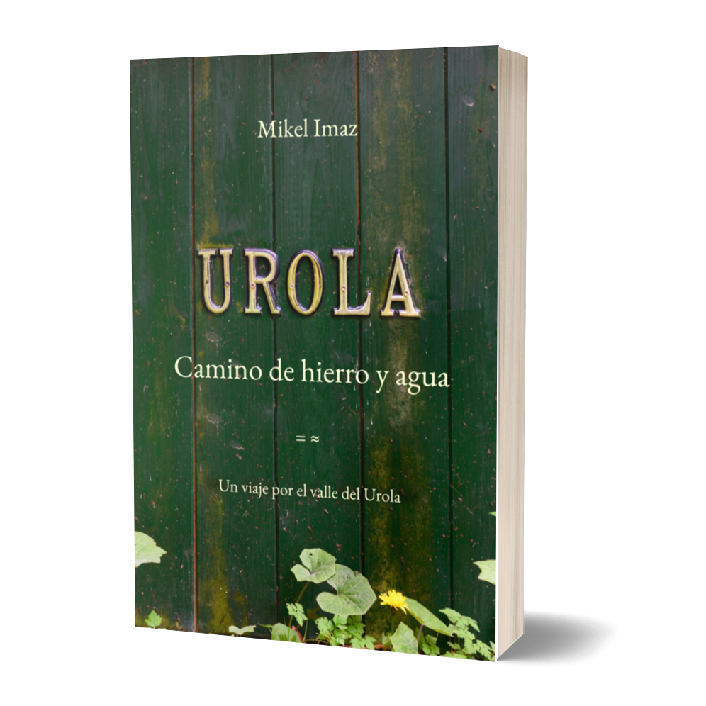

# :material-book-open-page-variant: &nbsp; Un viaje por el valle del Urola

{ width="450" }

«Un recorrido de tres días y varios siglos por la historia y los parajes únicos de este valle guipuzcoano».  
«Una indagación del progreso, la naturaleza y el tiempo».  
«Una invitación a la exploración de cercanía, al descubrimiento y al asombro».

&nbsp;

- [:material-bookshelf: &nbsp; Librerías](librerias.md)
- [:material-newspaper-variant: &nbsp; Blog](blog/index.md)
- [:material-map-outline: &nbsp; Mapas](mapas/index.md)
- [:octicons-link-external-16: &nbsp; Enlaces](enlaces.md)
- [:material-book-open-page-variant-outline: &nbsp; Del mismo autor](otros.md)
- [:material-face-man: &nbsp; Contacto](contacto.md)

