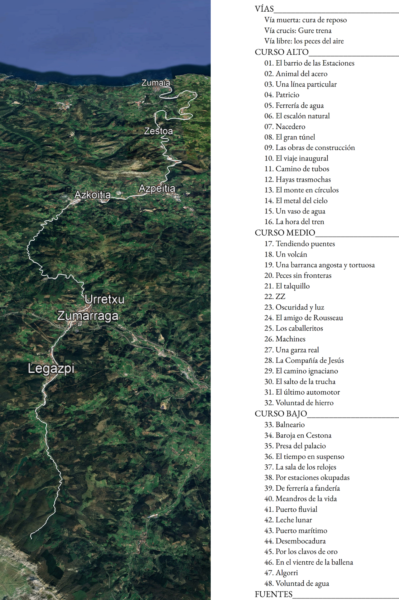
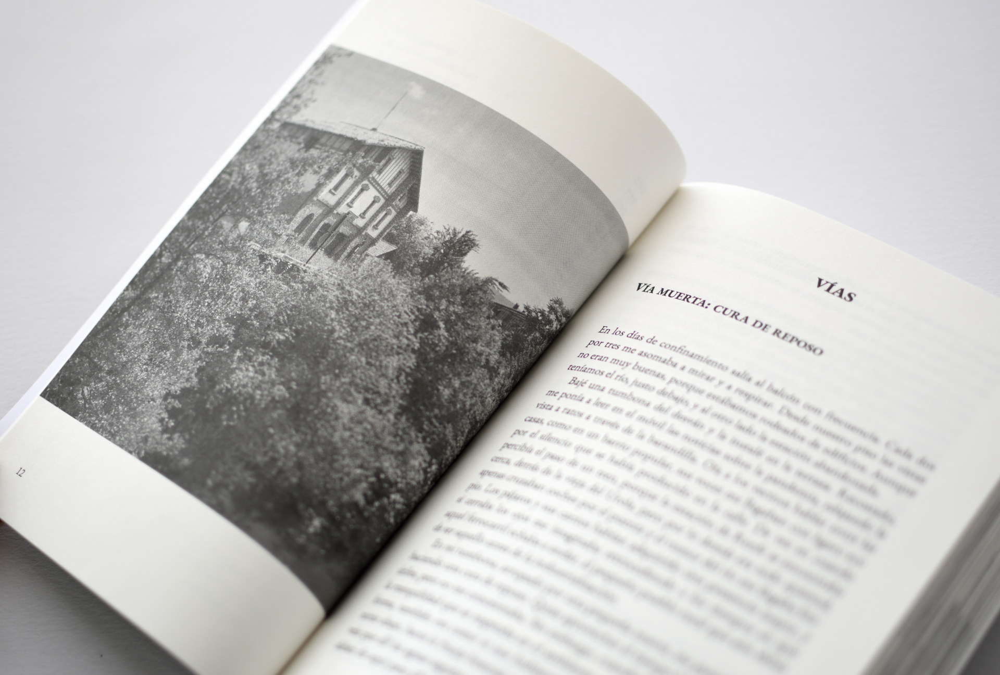
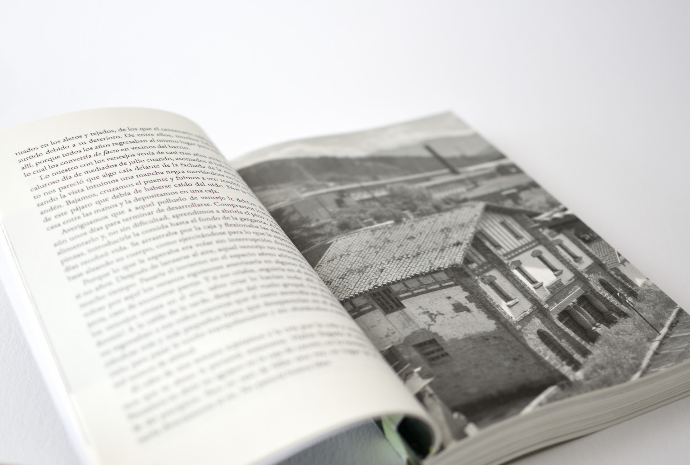
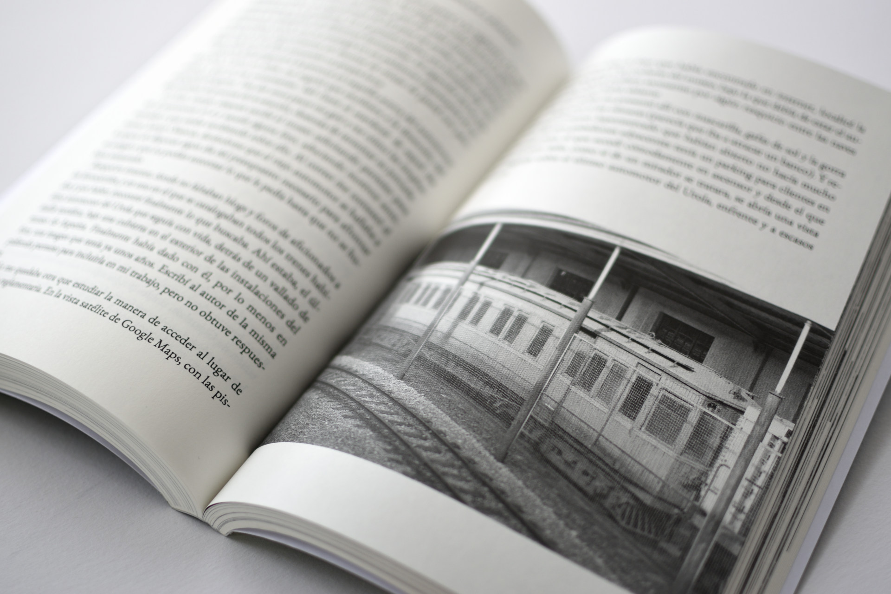
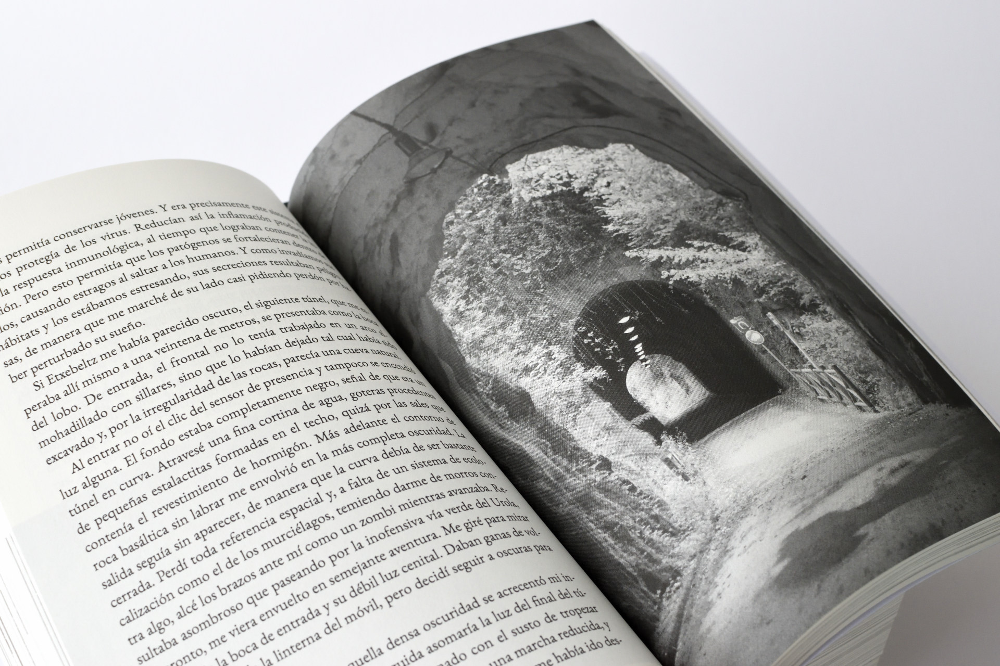
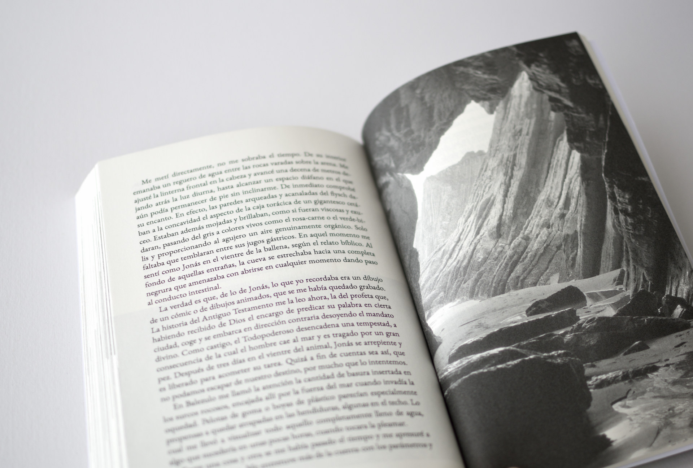

# :material-book-open-page-variant: &nbsp; Libro

<iframe width="560" height="315"
  src="https://www.youtube.com/embed/k9v6GuY0ibA"
  title="YouTube video player"
  frameborder="0"
  allow="accelerometer; autoplay; clipboard-write; encrypted-media; gyroscope; picture-in-picture"
  allowfullscreen>
</iframe>

&nbsp;

__:material-text: &nbsp; Ficha técnica__

`Título:` __Urola__  
`Subtítulo:` __Camino de hierro y agua__  
`Subtítulo descriptivo:` __Un viaje por el valle del Urola__  
`Autor:` __Mikel Imaz__  
`Editorial:` Autopublicación (2025)  
`Género:` Literatura de viajes  
`Extensión:` 350 págs.  
`Imágenes:` 100 (fotografías, mapas, ilustraciones, en blanco y negro)  
`Sinopsis:` (1)
{ .annotate }

1. Durante el confinamiento, el autor, desde su balcón, contempla el río y la estación abandonada. La vegetación crece sobre la vieja terminal del ferrocarril del Urola, símbolo en su época del progreso en el valle. Las aguas del río por su parte fluyen como siempre, indiferentes al estado de alarma. Este contraste despierta en el observador el interés por indagar en los orígenes del desarrollo en su entorno, muy ligado a la industria del hierro. Proyecta además un viaje para recorrer lugares importantes del pasado que hoy están olvidados e invadidos por la naturaleza. Siguiendo la pista del agua y del ferrocarril, cuyos cursos se entrelazan en el valle del Urola, buscará ese verano unir sus puntos en una línea.

&nbsp;

&nbsp;

- 

    > :fontawesome-solid-quote-left-alt: Desde nuestro piso las vistas no eran muy buenas, porque estábamos rodeados de edificios. Aunque teníamos el río, justo debajo, y al otro lado la estación abandonada. :fontawesome-solid-quote-right-alt:

- 

    > :fontawesome-solid-quote-left-alt: Arrancaba desde allí mismo, lo estaba viendo desde mi balcón, y ofrecía la posibilidad de ir andando, junto al río, a través de túneles y puentes, prácticamente hasta Zumaia. :fontawesome-solid-quote-right-alt:

- 

    > :fontawesome-solid-quote-left-alt: ¿Y dónde estaba? En mis visitas anteriores no lo había visto expuesto al público y en esta tampoco. Pero un tren no era algo que se pudiera esconder tan fácilmente, debía de estar por allí en algún lugar.:fontawesome-solid-quote-right-alt:

- 

    > :fontawesome-solid-quote-left-alt: Cuando volví ante mi taza de café con leche, le pregunté al hombre mayor cómo hacían las anguilas para superar las barreras como la que había allí fuera. «Ya saben ellas, ya buscan su manera», dijo, y siguió con su almuerzo. :fontawesome-solid-quote-right-alt:

- 

    > :fontawesome-solid-quote-left-alt: Les hice caso, apagué la linterna. Coincidió que seguido se apagaron todas las lámparas del túnel al haberse consumido su tiempo, de manera que de la penumbra pasé a quedarme a oscuras en su compañía. :fontawesome-solid-quote-right-alt:

- 

    > :fontawesome-solid-quote-left-alt: Me metí directamente, no me sobraba el tiempo. De su interior emanaba un reguero de agua entre las rocas varadas sobre la arena. :fontawesome-solid-quote-right-alt:

&nbsp;

[:material-cart: &nbsp; Comprar el libro](comprar.md){: .md-button .md-button--primary }