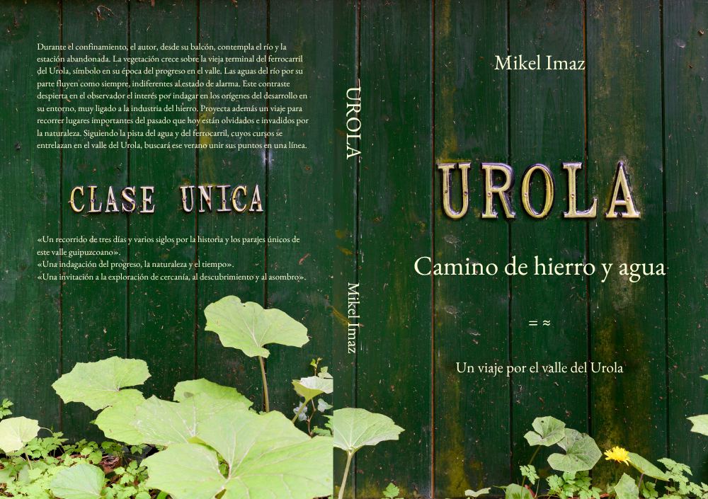

# :material-book-open-page-variant: Libro

{ width="450" }

_Título:_ __Urola__  
_Subtítulo:_ __Camino de hierro y agua__  
_Subtítulo descriptivo:_ __Un viaje por el valle del Urola__  

_Editorial_: autopublicación (2025)  
_Género:_ literatura de viajes  
_Extensión_: ~350 páginas (~85.000 palabras)  
_Imágenes:_ ~100 (fotografías, mapas, ilustraciones, en blanco y negro)  
_Formatos_: tapa blanda | tapa dura  
_Sinopsis:_
> Durante el confinamiento, el autor, desde su balcón, contempla el río y la estación abandonada. La vegetación crece sobre la vieja terminal del ferrocarril del Urola, símbolo en su época del progreso en el valle. Las aguas del río por su parte fluyen como siempre, indiferentes al estado de alarma. Este contraste despierta en el observador el interés por indagar en los orígenes del desarrollo en su entorno, muy ligado a la industria del hierro. Proyecta además un viaje para recorrer lugares importantes del pasado que hoy están olvidados e invadidos por la naturaleza. Siguiendo la pista del agua y del ferrocarril, cuyos cursos se entrelazan en el valle del Urola, buscará ese verano unir sus puntos en una línea.

  