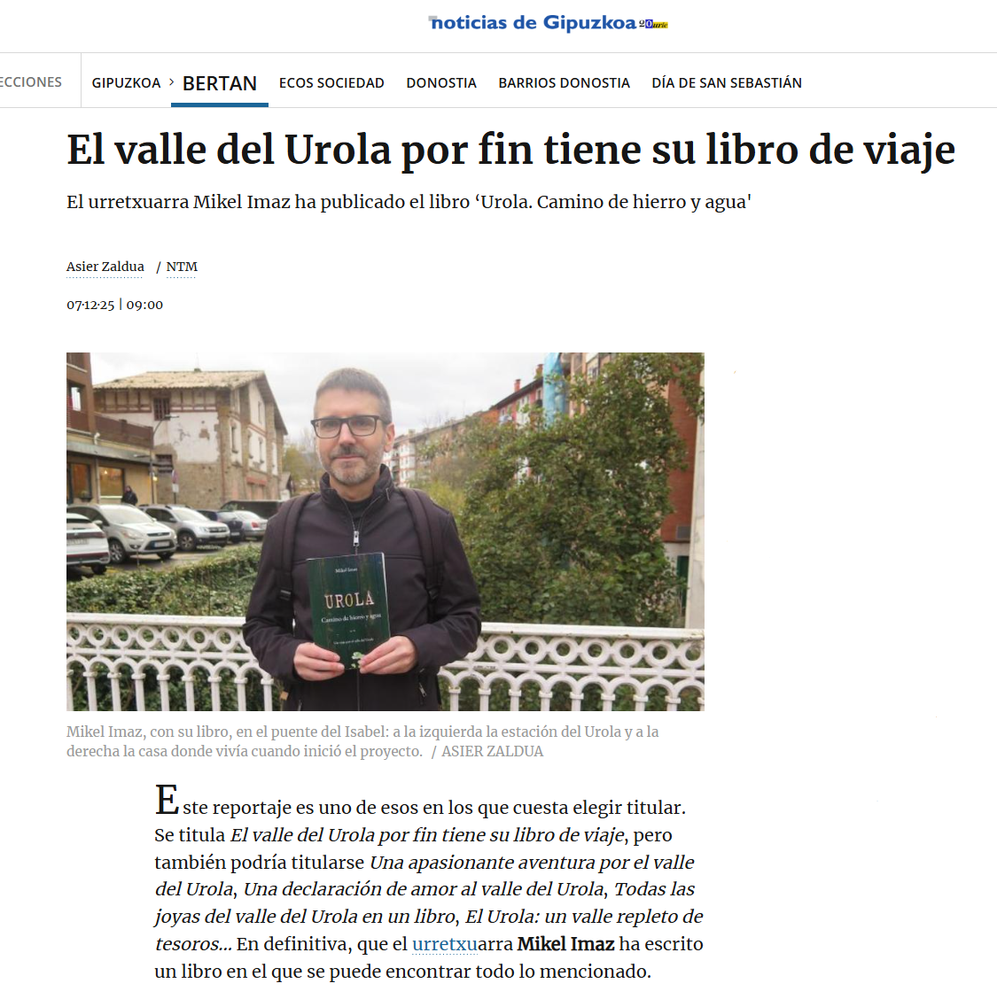

# :material-broadcast: &nbsp; Prensa

---

## :material-newspaper-variant: &nbsp; Reportaje en _Noticias de Gipuzkoa_
> 2025-12-07

Asier Zaldua me dedica [este reportaje en el diario _Noticias de Gipuzkoa_](https://www.noticiasdegipuzkoa.eus/gipuzkoa/bertan/2025/12/07/valle-urola-libro-viaje-10440012.html).

PDF :material-arrow-right: [:fontawesome-regular-file-pdf:](../pdfs/El%20valle%20del%20Urola%20por%20fin%20tiene%20su%20libro%20de%20viaje.pdf)

---

## :material-radio: &nbsp; Entrevista radiofónica 
> 2025-12-04

Mi amigo Lucio Sampietro me entrevista en su programa __Recorrido Latinoamericano – España__, de la radio comunitaria [CHHA 1610 AM](https://chha1610am.ca/) en Toronto (Canadá).

<iframe width="560" height="315"
  src="https://www.youtube.com/embed/dZMoLklbGFw"
  title="YouTube video player"
  frameborder="0"
  allow="accelerometer; autoplay; clipboard-write; encrypted-media; gyroscope; picture-in-picture"
  allowfullscreen>
</iframe>