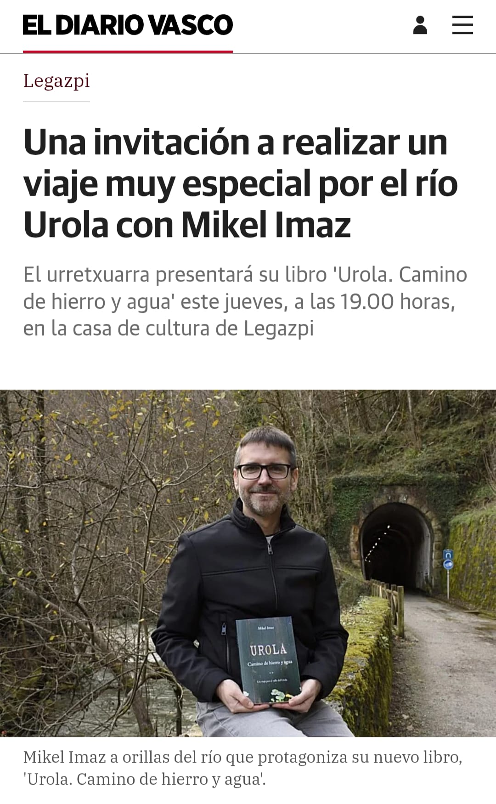
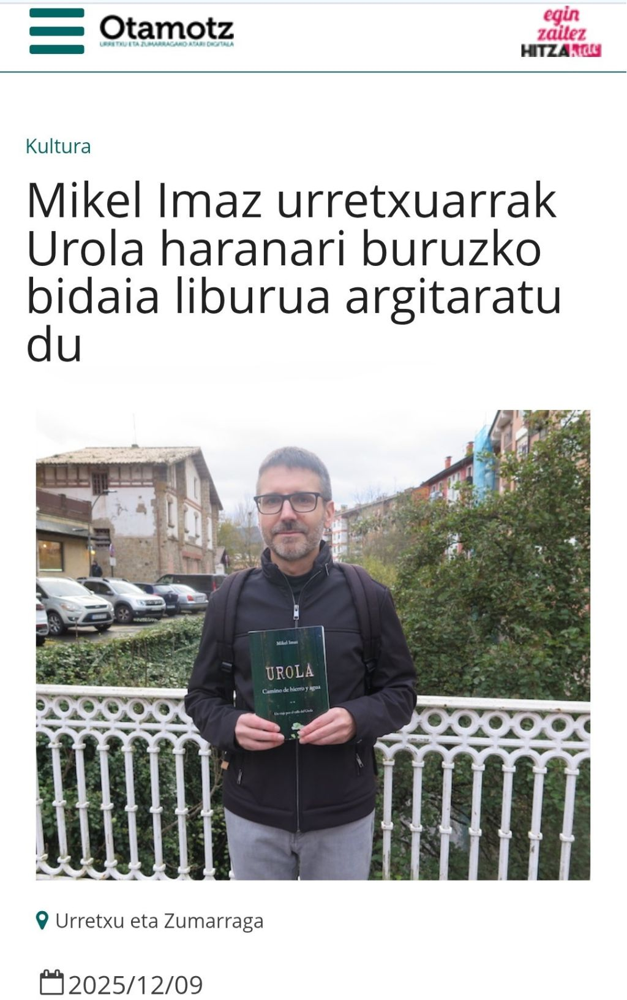
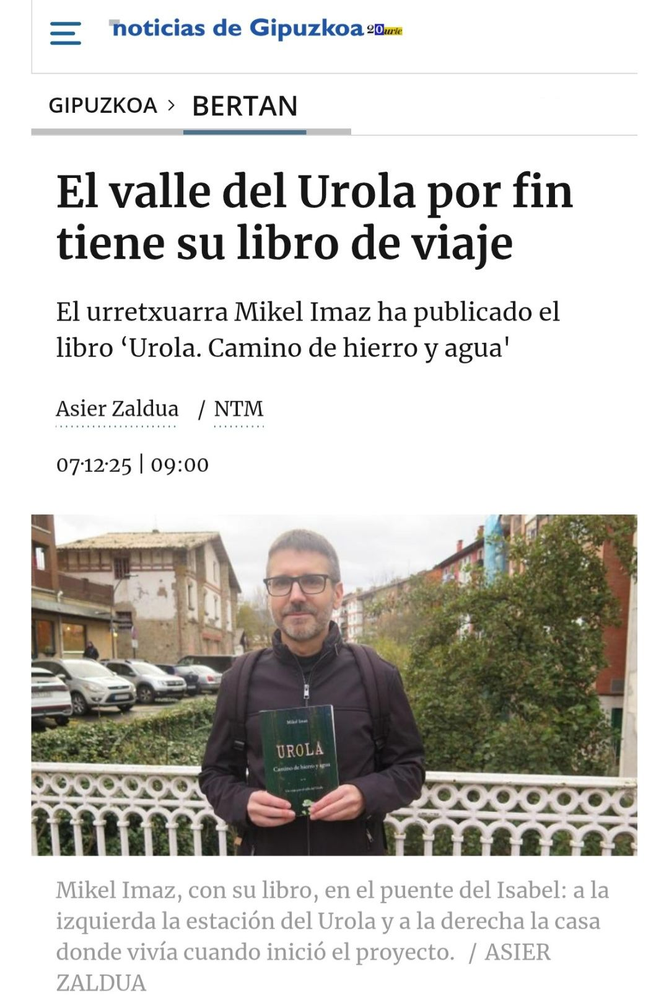

# :material-newspaper-variant: &nbsp; Prensa

---

## _El Diario Vasco_
> 2026-01-27

Cristina Limia escribe en [_El Diario Vasco_](https://www.diariovasco.com/alto-urola/legazpi/invitacion-realizar-viaje-especial-rio-urola-mikel-20260128212053-nt.html).

[{ width="450" }](https://www.diariovasco.com/alto-urola/legazpi/invitacion-realizar-viaje-especial-rio-urola-mikel-20260128212053-nt.html)

PDF :material-arrow-right: [:fontawesome-regular-file-pdf:](../pdfs/diariovasco.com-Una%20invitación%20a%20realizar%20un%20viaje%20muy%20especial.pdf)

---

## _Goierriko Hitza_, _Otamotz_
> 2025-12-09

Asier Zalduak idatzitako artikuluak [Goierriko Hitzan](https://goierri.hitza.eus/2025/12/09/otamotz-mikel-imaz-urretxuarrak-urola-haranari-buruzko-bidaia-liburua-argitaratu-du/) eta [Otamotzen](https://www.otamotz.eus/2025/12/09/mikel-imaz-urretxuarrak-urola-haranari-buruzko-bidaia-liburua-argitaratu-du/).

[{ width="450" }](https://www.otamotz.eus/2025/12/09/mikel-imaz-urretxuarrak-urola-haranari-buruzko-bidaia-liburua-argitaratu-du/)

PDF :material-arrow-right: [:fontawesome-regular-file-pdf:](../pdfs/GoierrikoHitza.pdf)

---

## _Noticias de Gipuzkoa_
> 2025-12-07

Asier Zaldua me dedica [este reportaje en el diario _Noticias de Gipuzkoa_](https://www.noticiasdegipuzkoa.eus/gipuzkoa/bertan/2025/12/07/valle-urola-libro-viaje-10440012.html).

[{ width="450" }](https://www.noticiasdegipuzkoa.eus/gipuzkoa/bertan/2025/12/07/valle-urola-libro-viaje-10440012.html)

PDF :material-arrow-right: [:fontawesome-regular-file-pdf:](../pdfs/El%20valle%20del%20Urola%20por%20fin%20tiene%20su%20libro%20de%20viaje.pdf)