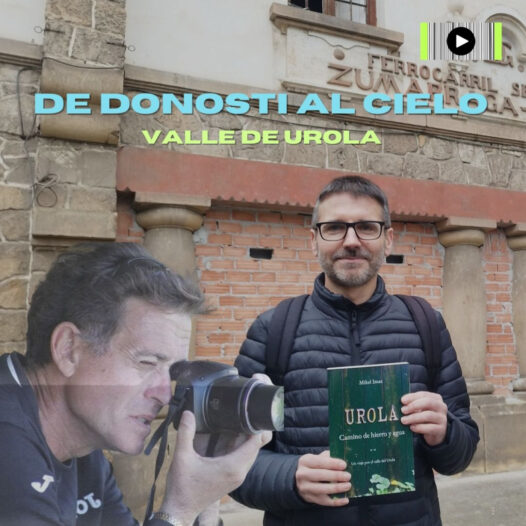
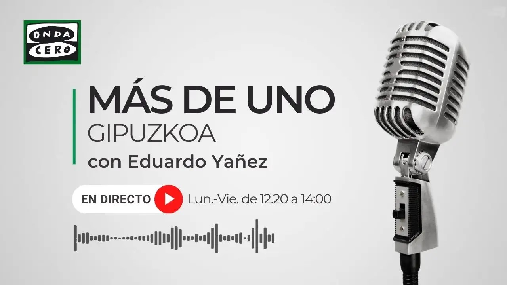

# :material-radio: &nbsp; Radio

## Radio Viajera, _De Donosti al cielo_
> 2026-02-03

Carlos Bengoa me hace [esta entrevista](https://radioviajera.com/valle-de-urola/) para el canal de podcasts de viajes Radio Viajera.

[{ width="450" }](https://radioviajera.com/valle-de-urola/)

"Con Carlos Bengoa desde San Sebastián, hablamos en Zumarraga con Mikel Imaz sobre su libro _Urola, camino de hierro y agua_."

Archivo MP3 :material-arrow-right: [:fontawesome-solid-ear-listen:](../mp3s/radio_viajera_urola.mp3)

---

## Onda Cero, Gipuzkoa
> 2026-01-27

Santiago Yañez me hace [esta entrevista -entre los minutos 22 y 32-](https://www.ondacero.es/podcast/emisoras/san-sebastian/mas-de-uno-gipuzkoa/mas-uno-gipuzkoa-27012026_202601276978b4dcba57744c74baed88.html) en su programa _Más de uno Gipuzkoa_, magazine de actualidad de Gipuzkoa.

[{ width="450" }](https://www.ondacero.es/podcast/emisoras/san-sebastian/mas-de-uno-gipuzkoa/mas-uno-gipuzkoa-27012026_202601276978b4dcba57744c74baed88.html)

Archivo MP3 :material-arrow-right: [:fontawesome-solid-ear-listen:](../mp3s/ondacero_urola.mp3)

---

## CHHA 1610 AM, Toronto (Canadá)
> 2025-12-04

Mi amigo Lucio Sampietro me entrevista en su programa __Recorrido Latinoamericano – España__, de la radio comunitaria [CHHA 1610 AM](https://chha1610am.ca/) en Toronto (Canadá).

<iframe width="560" height="315"
  src="https://www.youtube.com/embed/dZMoLklbGFw"
  title="YouTube video player"
  frameborder="0"
  allow="accelerometer; autoplay; clipboard-write; encrypted-media; gyroscope; picture-in-picture"
  allowfullscreen>
</iframe>