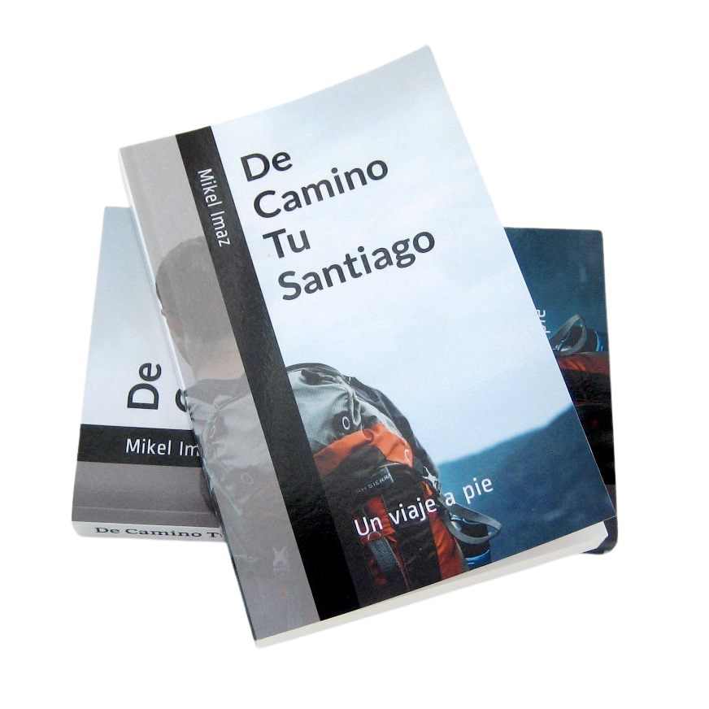

# :material-bookshelf: &nbsp; Otro viaje

_De Camino Tu Santiago. Un viaje a pie_ (2019)

{ width="450" }

<!-- [:simple-youtube: :material-arrow-down-right:](https://www.youtube.com/watch?v=lUGvayHPuvs)

 -->

<iframe width="560" height="315"
  src="https://www.youtube.com/embed/lUGvayHPuvs"
  title="YouTube video player"
  frameborder="0"
  allow="accelerometer; autoplay; clipboard-write; encrypted-media; gyroscope; picture-in-picture"
  allowfullscreen>
</iframe>

Opiniones de los lectores: (1)
{ .annotate }

1.  "Un relato muy fresco, muy vivo."

    "Desperdigados por el libro hay elementos que me hicieron reír un buen rato. Realmente consigue transmitir esa sensación de que por un mes, durante el trayecto, uno aparca su vida y disfruta de las cosas simples."

    "Me he sentido muy identificado con las sensaciones del protagonista. Me ha hecho viajar con él. A pesar de tratarse de un diario de viaje, no me ha resultado nada repetitivo y sobre todo está muy bien escrito."

    "Yo me fijo especialmente en cómo empieza y termina un libro; el principio me gustó; pero es que el final me pareció muy bueno."

    "Muy ameno y entretenido. Y muy, muy sincero."

    "Lo he disfrutado como ninguno de los libros similares que he leído hasta ahora. Refleja a la perfección lo que es un auténtico Camino, sin idioteces basadas en tópicos. El autor ha elaborado un relato muy completo, profundo y coherente. Ojalá se promocione esta obra porque sería muy conveniente que tuviera amplia difusión y quienes van al Camino supieran de verdad en qué consiste este viaje."

    "Me ha gustado por el estilo sencillo, por la frescura con la que relata su Camino, la ausencia de prepotencia y la naturalidad en el relato."

    "Después de leer el libro me han dado ganas de hacer el Camino."

Disponible en [:fontawesome-brands-amazon: Amazon](https://amzn.eu/d/dbhctHC)